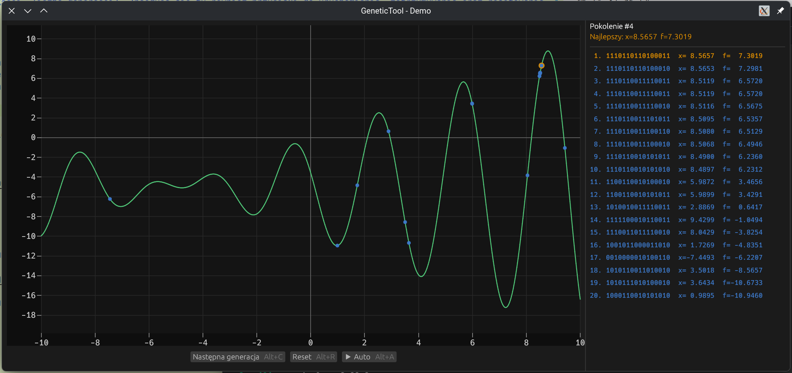

# genetictool-rs

## Opis programu

Program genetictool-rs jest graficzną demonstracją działania algorytmu genetycznego. Zawiera prostą implementację GA, wykorzystującą mutację, krzyżowanie, selekcję turniejową oraz elityzm. Interfejs został zbudowany w oparciu o bibliotekę egui.

Algorytm genetyczny jest użyty aby znaleźć maksimum wybranej funkcji.

## Platformy

Aplikacja została przetestowana na systemach Linux oraz macOS. Teoretycznie powinna działać też na Windows, ale nie chciało mi się tam sprawdzać.


## Instrukcja obsługi

Główne okno programu podzielone jest na dwie części:

- **Centralna część (środek okna)**: Wyświetla wykres funkcji celu, na której działa algorytm genetyczny. Na wykresie widoczne są punkty reprezentujące aktualną populację (niebieskie kropki), a najlepszy osobnik jest wyróżniony kolorem pomarańczowym. Wykres jest interaktywny – po najechaniu kursorem wyświetlane są współrzędne.

- **Prawa część okna**: Panel populacji. Wyświetla listę wszystkich chromosomów w bieżącej populacji, ich wartości oraz fitness. Najlepszy osobnik jest wyróżniony.


### Pasek przycisków (na dole wykresu)

- **Następna generacja**: Uruchamia obliczenie kolejnej generacji algorytmu genetycznego.
- **Reset**: Przywraca populację do stanu początkowego (losowa populacja startowa).
- **Auto**: Przełącza tryb automatycznego obliczania kolejnych generacji.

Przyciski można obsługiwać również skrótami klawiszowymi:
- Alt+C – Następna generacja
- Alt+R – Reset
- Alt+A – Auto

## Zrzut ekranu

Zrzut ekranu z KDE, ciemny motyw kolorystyczny:



## Uruchamianie

   ```sh
   git clone https://github.com/antekone/genetictool-rs.git
   cd genetictool-rs
   cargo run --release
   ```

## Licencja

Projekt udostępniany jest na warunkach licencji MIT.
